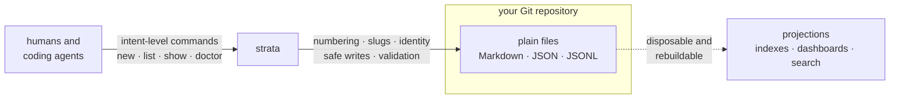
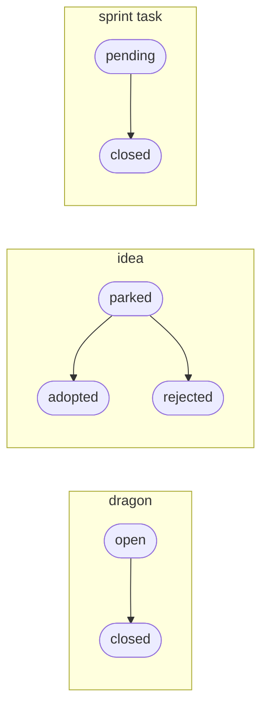

<div align="center">
  <picture>
    <source media="(prefers-color-scheme: dark)" srcset="assets/logo-dark.svg">
    
  </picture>

  <p><strong>Git-native project archaeology and structured repository memory<br>for humans and coding agents.</strong></p>
</div>

---

Every project accumulates knowledge that never makes it into the code: why an
unusual design exists, which risks are known but unresolved, which tradeoffs
were settled and on what evidence. Most of it evaporates — into closed tabs,
stale chat threads, and the heads of people who leave.

Strata keeps that knowledge **in the repository, as ordinary files**, and gives
humans and coding agents safe, intent-level commands for maintaining it:

- **decisions** — settled tradeoffs, with their reasoning preserved
- **dragons** — known unresolved risks, kept visible until slain
- **ideas** — uncommitted proposals, parked until adopted or rejected
- **logs** — durable discoveries that would otherwise be re-researched
- **sprints** — scoped slices of work and their outcomes

The filesystem is canonical. Git provides history. Strata supplies numbering,
identity, validation, and machine-readable projections — nothing you can't
read or edit with a text editor.

## See it work

This repository is Strata's first user: its own risks, decisions, and work
items are tracked with the tool. The output below is real.

```console
$ strata list dragons
dragon:1  open  Branch sequence collisions  (archaeology/dragons/open/0001-branch-sequence-collisions.md)
dragon:2  open  Repository validity is not closed under Git round-trip  (archaeology/dragons/open/0002-repository-validity-not-closed-under-git-round-trip.md)
dragon:3  open  Reference marker syntax and typed edge vocabulary  (archaeology/dragons/open/0003-reference-marker-syntax-and-typed-edge-vocabulary.md)

$ strata show dragon:3
---
id: drg_01KY169X7W0YXJ5QFV4D1MK4FB
sequence: 3
kind: dragon
status: open
created: 2026-07-20
---

# Reference marker syntax and typed edge vocabulary

## Context

Decision 0006 (`dec-bootstrap-reference-model`) settled reference
semantics — stable-ID targets with frozen labels, write-time binding, …
```

Automation gets the same facts without parsing prose:

```console
$ strata list dragons --json | jq '.[-1]'
{
  "id": "drg_01KY169X7W0YXJ5QFV4D1MK4FB",
  "sequence": 3,
  "kind": "dragon",
  "status": "open",
  "title": "Reference marker syntax and typed edge vocabulary",
  "created": "2026-07-20",
  "path": "archaeology/dragons/open/0003-reference-marker-syntax-and-typed-edge-vocabulary.md"
}
```

> **Why "dragons"?** Old maps marked unexplored territory *hic sunt dracones* —
> here be dragons. A dragon is a known risk nobody has resolved yet. Keeping it
> as a first-class, listable artifact means it stays on the map instead of in
> someone's memory.

## How it fits



The arrows only point one way for a reason:

- **Files are canonical.** No database, hidden state, or remote service is
  required to understand or modify a Strata repository.
- **Strata never holds a repository hostage.** Everything stays readable and
  editable without the executable — it's just Markdown, JSON, and JSONL.
- **Display numbers are not identity.** `0003-…` prefixes exist for humans;
  each artifact also carries a stable ID (a ULID), so concurrent branches can
  collide on sequence numbers without corrupting anything.
- **One core, two interfaces.** Human-readable output by default,
  deterministic `--json` for automation — same semantics, no parallel logic.
- **Projections are disposable.** Any future index or dashboard must be
  rebuildable from the files and must never become the only home of a fact.
- **Git is optional at the core.** History and provenance features may use it;
  basic operation doesn't require it.

## Artifact lifecycles

Artifacts move between lifecycle directories; their `status` metadata and
placement must always agree — that's one of the invariants `doctor` exists to
check. Terminal states are moves, never deletions: history is the product.



```text
archaeology/
├── decisions/          settled tradeoffs and their evidence
├── dragons/
│   ├── open/           risks that still bite
│   └── closed/         risks resolved, with how
├── ideas/
│   ├── parked/         proposals awaiting a decision
│   ├── adopted/        promoted into decisions
│   └── rejected/       declined, with reasoning kept
├── logs/               durable discoveries
└── sprints/
    └── 0001-bootstrap/
        ├── sprint.md
        ├── pending/
        └── closed/
```

## Status

Strata is bootstrapping its smallest useful vertical slice. Honest scoreboard:

| Command | What it does | Status |
| --- | --- | --- |
| `strata init` | initialize a repository | ✅ |
| `strata new dragon "…"` | create an artifact; sequence, slug, and ID assigned safely | ✅ |
| `strata list dragons [--json]` | discover and list artifacts | ✅ |
| `strata show dragon:N` | inspect one artifact | ✅ |
| `strata doctor` | validate repository invariants | 🚧 surface defined, checks in progress |

The bootstrap hardcodes the `dragon` collection while the mechanics are
proven; the other collections above are maintained manually until then.
Daemons, indexes, embeddings, semantic search, MCP, GraphQL, and dashboards
are deliberately deferred — each would need a recorded decision and evidence
that the layer beneath it is useful.

## Development

```sh
cargo build
cargo test
cargo run -- --help
scripts/check.sh   # format, lint, test
```

Strata is also a case study in human–AI collaboration on long-lived projects.
[`CLAUDE.md`](CLAUDE.md) holds the project invariants and agent workflow, and
[`archaeology/`](archaeology/) is the living record — the decisions, dragons,
and sprints behind every change in this repository.
